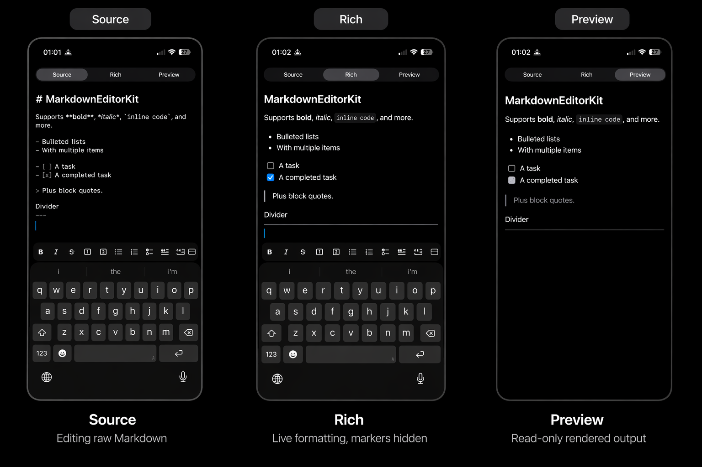

# MarkdownEditorKit

[](https://github.com/rouzbeh-abadi/MarkdownEditorKit/actions/workflows/ci.yml)

A SwiftUI Markdown editor with inline syntax highlighting, a keyboard-accessory formatting toolbar, and a read-only rendered preview — built on top of `UITextView`.



*From left to right: **Source** — editing raw Markdown with live highlighting; **Rich** — syntax markers hidden, formatting applied inline while you type; **Preview** — read-only rendered output.*

## Features

- Drop-in SwiftUI view: `MarkdownEditor(text: $markdown)`.
- Live Markdown syntax highlighting while you type — headings, emphasis, lists (bulleted, numbered, and task), quotes, inline and fenced code, and links.
- Floating formatting toolbar above the keyboard while editing, and at the bottom of the editor when the keyboard is dismissed. The toolbar sits inside its host with a rounded background and outer margins.
- Task-list (`- [ ]` / `- [x]`) support, including a checkbox toolbar action.
- Three display modes: `.source` (editable with live highlighting), `.rich` (editable with syntax markers visually collapsed — a WYSIWYG-style live edit over the raw Markdown), and `.preview` (a read-only render).
- Optional host-handled image picking: surface the `.imagePicker` action and provide an `onImagePick` closure to route the tap back into your app.
- Customisable action set, fonts, colors, and layout metrics via `MarkdownEditorConfiguration`.
- A pure, testable `MarkdownFormatter` and `MarkdownRenderer` you can drive from your own UI.

## Requirements

- iOS 17+
- Swift 6.0+ (Swift 6 language mode)
- Xcode 16+

## Installation

### Swift Package Manager

Add the package to your `Package.swift`:

```swift
dependencies: [
    .package(url: "https://github.com/rouzbeh-abadi/MarkdownEditorKit.git", from: "1.0.0")
]
```

…and to your target:

```swift
.target(name: "YourApp",
        dependencies: ["MarkdownEditorKit"])
```

Or, in Xcode, choose **File → Add Package Dependencies…** and enter the repository URL.

## Usage

### Basic editor

```swift
import SwiftUI
import MarkdownEditorKit

struct NoteEditorView: View {
    @State private var markdown = "# Notes\n\nStart writing…"

    var body: some View {
        MarkdownEditor(text: $markdown)
            .frame(minHeight: 240)
    }
}
```

### Source, rich, and preview modes

The editor supports three modes — a live editable source view, a WYSIWYG-style editable rich view, and a read-only rendered preview. The host app decides which is active, so the same bound text can be inspected in any form without losing edits:

```swift
struct NoteView: View {
    @State private var markdown = "# Hello\n\nIt's **working**."
    @State private var mode: MarkdownEditorMode = .source

    var body: some View {
        VStack {
            Picker("Mode", selection: $mode) {
                Text("Source").tag(MarkdownEditorMode.source)
                Text("Rich").tag(MarkdownEditorMode.rich)
                Text("Preview").tag(MarkdownEditorMode.preview)
            }
            .pickerStyle(.segmented)
            .padding(.horizontal)

            MarkdownEditor(text: $markdown, mode: mode)
        }
    }
}
```

- `.source` shows the raw Markdown with live syntax highlighting — the markers stay visible as you type.
- `.rich` keeps the text editable and the toolbar shown, but collapses Markdown markers so the view looks like the rendered output while you type: `**bold**` reads as **bold** with the asterisks hidden, `# Heading` renders as a larger bold line, and so on. The underlying text remains raw Markdown, so the bound source round-trips cleanly between modes.
- `.preview` renders a read-only view where markers are removed and their formatting is applied: `- [ ] task` is shown with a ballot-box glyph, links become tappable, fenced code blocks stay monospaced, and the toolbar is not shown.

### Host-handled image picking

The `.image` toolbar action inserts raw Markdown image syntax. To instead hand off to a host-provided image picker — a `PhotosPicker`, an uploader, a custom UIKit sheet — surface the `.imagePicker` action and provide an `onImagePick` closure:

```swift
let configuration = MarkdownEditorConfiguration(enabledActions: [.bold,
                                                                 .italic,
                                                                 .heading(level: 1),
                                                                 .bulletList,
                                                                 .taskList,
                                                                 .imagePicker,
                                                                 .link])

MarkdownEditor(text: $markdown,
               configuration: configuration,
               onImagePick: { showPhotoPicker = true })
```

When `onImagePick` is `nil`, the `.imagePicker` button is hidden automatically, so the two can be wired up together without the button ever appearing as a no-op.

### Custom toolbar and appearance

```swift
var toolbarStyle = Style.Toolbar()
toolbarStyle.outerHorizontalPadding = 16
toolbarStyle.cornerRadius = 14

let configuration = MarkdownEditorConfiguration(enabledActions: [.bold, .italic, .heading(level: 1), .bulletList, .link],
                                                highlightsSyntax: true,
                                                font: .preferredFont(forTextStyle: .body),
                                                syntaxColor: .tertiaryLabel,
                                                style: Style(toolbar: toolbarStyle))

MarkdownEditor(text: $markdown, configuration: configuration)
```

### Driving the formatter directly

Every toolbar button goes through `MarkdownFormatter`, which is a pure utility you can use on its own if you have a different UI or need to apply formatting server-side:

```swift
let result = MarkdownFormatter.apply(.bold,
                                     to: "Hello, world!",
                                     in: NSRange(location: 0, length: 5))
// result.text      → "**Hello**, world!"
// result.selection → NSRange(location: 2, length: 5)
```

### Rendering previews yourself

`MarkdownRenderer` produces an `NSAttributedString` suitable for any read-only display — the editor uses it internally, and you can too:

```swift
let style = MarkdownRenderer.Style(bodyFont: .preferredFont(forTextStyle: .body),
                                   monospacedFont: .monospacedSystemFont(ofSize: 16, weight: .regular),
                                   textColor: .label,
                                   syntaxColor: .secondaryLabel)
let attributed = MarkdownRenderer(style: style).render("# Hello\n\nIt's **working**.")
```

## Testing

Tests are written with Swift Testing and can be run from Xcode or, from the command line, with an iOS Simulator destination:

```sh
xcodebuild test \
    -scheme MarkdownEditorKit \
    -destination 'platform=iOS Simulator,name=iPhone 16'
```

## License

MIT — see the [LICENSE](LICENSE) file for details.
